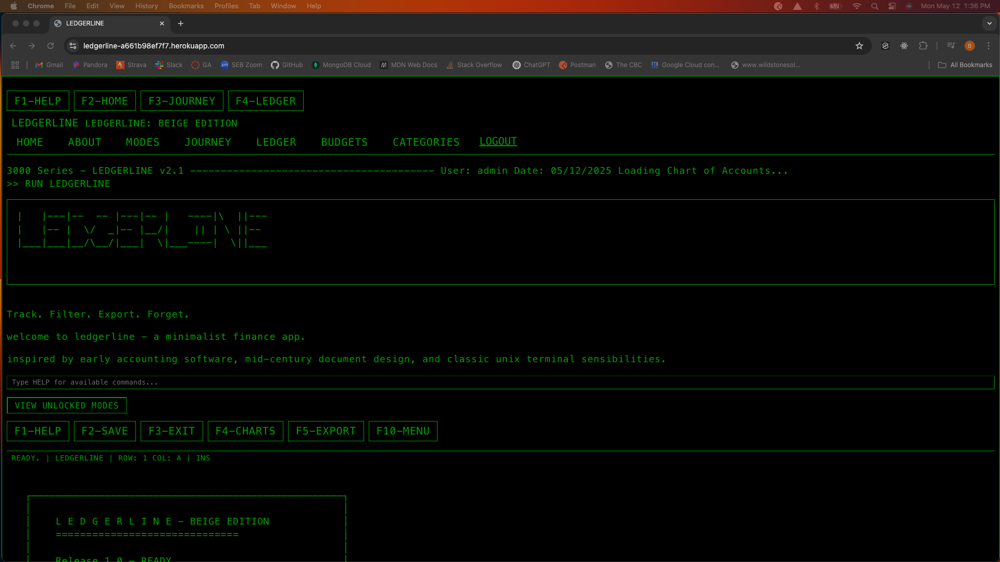

  

<h2 align="center">LedgerLine</h2>

LedgerLine is a minimalist finance app built on Django, 
thoughtfully crafted for individuals, LLCs, and solo operators. 
Inspired by the clarity and calm of mid-century accounting, LedgerLine 
delivers a clean, practical, and serene user experience. By focusing on 
essential ledger functions and removing clutter, it brings back the joy 
of simple, effective financial management—channeling the spirit of early 
Mint.com, but with a distinctive, design-forward twist. LedgerLine makes 
tracking your finances not just easy, but genuinely enjoyable. You can start your journey here:

https://ledgerline-a661b98ef7f7.herokuapp.com/

## Deployment Version
<h3 align="center">Desktop</h3>

    

## Planning Tools
**[Trello Board](https://trello.com/b/msnFZSPq/finance-tracker)**  
**GitHub:** [Back-end Repo](https://github.com/brady-newhard/LedgerLine)  

## Attributions
LedgerLine 1985 Theme

## Technologies
<h3 align="left">Languages and Tools:</h3>

## Future Enhancement
- Graphical visualization of how the money is be spent
- Add external accounts to automatically update income
- Secret link to Oregon Trail
